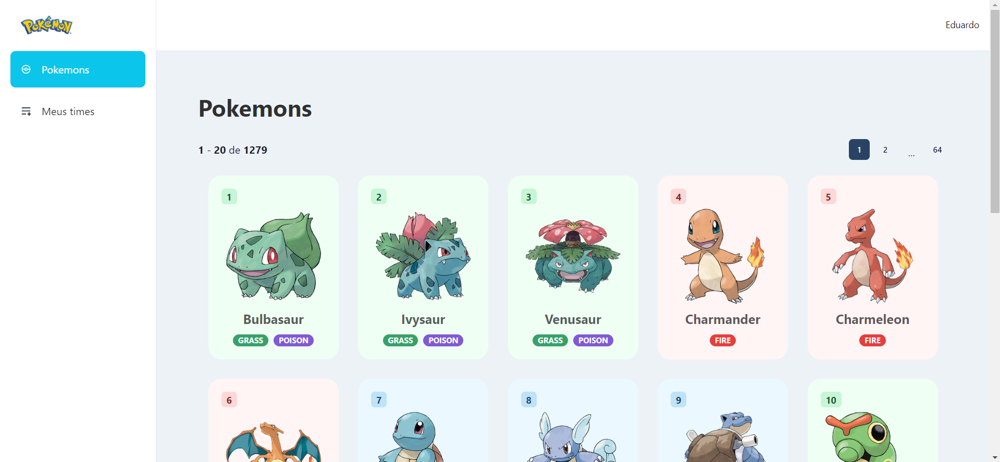

<h1 align="center">
  Minha pokedex
</h1>

Desafio técnico da Cresce.ai

  

  

 

## Tecnologias

Este projeto foi desenvolvido com as seguintes tecnologias:

Frontend

- React
- TypeScript
- Chakra-ui
- Redux Toolkit
- Vite
- Clean Architecture

Backend
- Node.js
- Express
- TypeScript
- TypeORM

## Execute o projeto

1. Clone este repositório `git clone https://github.com/dudunog/pokedex-cresce-ai.git`
2. Entre no diretório backend do projeto com `cd backend`
3. Instale as dependências com `npm install`
4. Crie um arquivo .env na raiz do backend seguindo o template do arquivo `.env.template`
5. Inicie o docker com `npm run db:dev`
6. Execute as migrations com `npm run migration:run`
7. Inicie o backend do projeto em modo desenvolvimento com `npm run dev`
8. Entre no diretório frontend do projeto `cd frontend`
9. Instale as dependências com `yarn install`
10. Crie um arquivo .env na raiz do projeto seguindo o template do arquivo `.env.template`
11. Inicie o frontend do projeto em modo desenvolvimento com `yarn run dev`
12. Pronto. O projeto já estará sendo exectutado em `http://localhost:3000`
